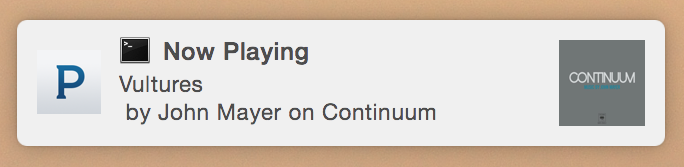

# pianobar-notifier

Terminal notifications for [pianobar](https://github.com/PromyLOPh/pianobar)



Using pianobar's `eventcmd` interface, this script uses [terminal-notifier](https://github.com/julienXX/terminal-notifier) to pop up notifications for **Now Playing!**

## Installation

* Download the script or clone the repo

```sh
git clone https://github.com/avidit/pianobar-notifier.git
```

* Copy the script to pianobar config folder `~/.config/pianobar/`

```sh
cp pianobar-notifier.rb ~/.config/pianobar/
```

* Add the following line to pianobar config file `~/.config/pianobar/config`

```ini
event_command = ~/.config/pianobar/pianobar-notifier.rb
```

If you don't have above directory or file, go ahead and create it. For more information take a look at [example config file](https://github.com/PromyLOPh/pianobar/blob/master/contrib/config-example)

## Requirements

* [Ruby](https://www.ruby-lang.org)
* [Pandora account](https://www.pandora.com/account/register)
* [pianobar](https://github.com/PromyLOPh/pianobar)
* [terminal-notifier](https://github.com/julienXX/terminal-notifier)
